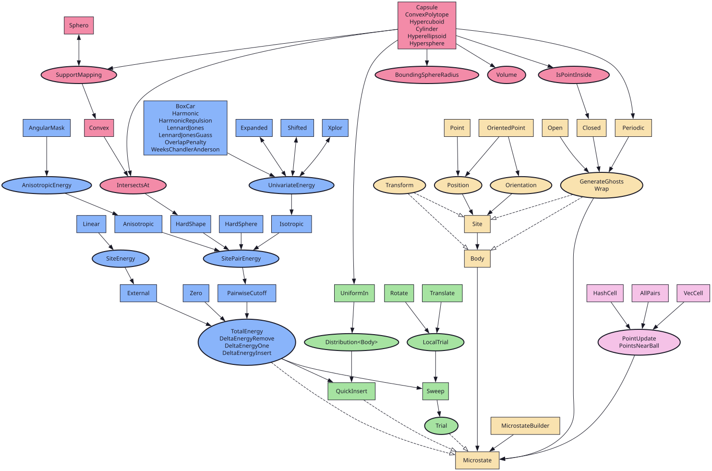

# API Reference

## Modules

- [hoomd-chimes](api/hoomd_chimes/index.html)
- [hoomd-bevy](api/hoomd_bevy/index.html)
- [hoomd-gsd](api/hoomd_gsd/index.html)
- [hoomd-geometry](api/hoomd_geometry/index.html)
- [hoomd-interaction](api/hoomd_interaction/index.html)
- [hoomd-linear-algebra](api/hoomd_linear_algebra/index.html)
- [hoomd-manifold](api/hoomd_manifold/index.html)
- [hoomd-mc](api/hoomd_mc/index.html)
- [hoomd-microstate](api/hoomd_microstate/index.html)
- [hoomd-rand](api/hoomd_rand/index.html)
- [hoomd-simulation](api/hoomd_simulation/index.html)
- [hoomd-spatial](api/hoomd_spatial/index.html)
- [hoomd-utility](api/hoomd_utility/index.html)
- [hoomd-vector](api/hoomd_vector/index.html)

## Structure Overview

[*Full-size structure with links to the documentation.*](images/structure.svg)
